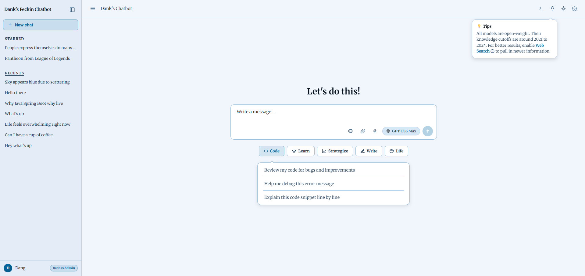
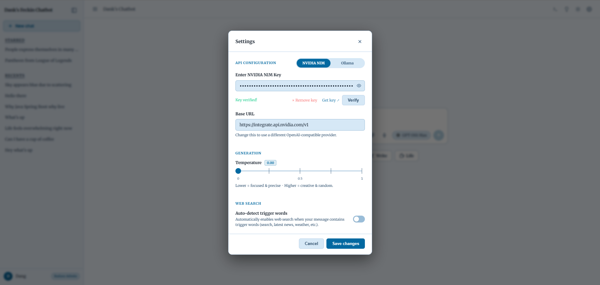
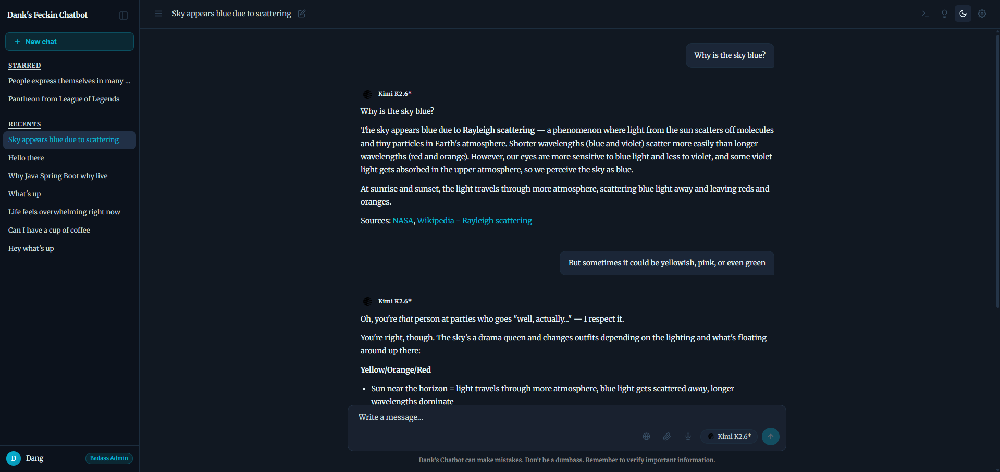
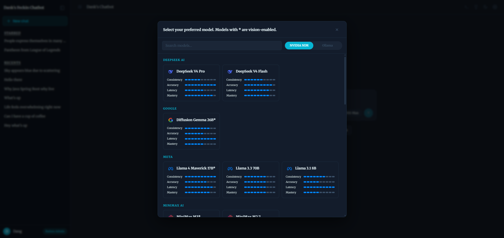

# Dank's Chatbot

A self-hosted AI chat interface powered by [NVIDIA NIM](https://build.nvidia.com/) and [Ollama](https://ollama.com/) (or any OpenAI-compatible API). Built with FastAPI, SQLite, and vanilla JavaScript.

---

## Demo Screenshots






---

## Features

- **Multi-provider** — switch between NVIDIA NIM and Ollama (or any OpenAI-compatible endpoint) via a pill toggle
- **Multi-model support** — switch models mid-conversation; full history is always passed to the new model
- **Duo Mode** — chat with two models simultaneously side-by-side to compare responses; supports independent scrolling and synchronized retries
- **Streaming responses** with real-time token rendering and a **stop button** to cancel generation at any time
- **Persistent chat history** — all conversations stored in a local SQLite database
- **Starred / recent chats** in a collapsible sidebar; auto-titles chats from the first message
- **Chat Search & Management** — search through all past conversations, bulk select, bulk star/unstar, and bulk delete chats via a dedicated modal
- **Markdown + math** — rendered via marked.js, highlight.js, and KaTeX (LaTeX math blocks)
- **Edit & retry** — inline-edit any user message; retry the last assistant response
- **Copy & download** — copy button on messages and code blocks; download button on code blocks
- **Image attachments** — attach images inline; passed as base64 to vision-capable models
- **Document attachments** — attach PDF, DOCX, PPTX, XLSX, or plain text files; text is extracted and sent as context (up to 120 000 chars)
- **Web search** — globe toggle enables live search via DuckDuckGo + Jina Reader + MediaWiki API; semantic reranking via NIM embeddings; auto-triggers on search-intent phrases; per-chat state in `localStorage`
- **Dark / light theme** toggle, persisted in `localStorage`
- **Settings modal** — configure API key, base URL, generation temperature, and UI behaviors (like auto-scrolling); key verification built in
- **Voice input** — microphone button for hands-free message dictation via the Web Speech API
- **Config-driven architecture** — add/remove models, background tasks (titles, query rewrites, embeddings), and API config entirely in `models.yaml`, no code changes needed
- **Model warmup** — keeps the selected NIM model warm to avoid cold-start delays
- **Auto-opens** the most recently updated chat on page load

---

## Project Structure

```
Chatbot/
├── main.py              # FastAPI app entry point, router registration
├── config.py            # models.yaml loading and helpers
├── database.py          # SQLite init and connection helper
├── llm.py               # LLM stream wrapper, think-tag filter, creator guard
├── schemas.py           # Pydantic request/response models
├── models.yaml          # Model lists (NIM + Ollama), API config, defaults
├── .system_prompt       # Optional system prompt override (plain text)
├── requirements.txt
├── icon/                # Provider icon PNGs served at /icon/*
├── search/
│   ├── classifier.py    # Intent routing (reddit, cambridge, youtube, docs)
│   ├── fetcher.py       # Page fetching (MediaWiki API, Jina, Trafilatura)
│   └── pipeline.py      # Query rewrite, DDG search, rerank, context assembly
├── routers/
│   ├── chats.py         # Chat CRUD (create, list, get, update, delete)
│   ├── messages.py      # SSE message streaming, regenerate, title gen
│   ├── files.py         # Document text extraction endpoint
│   └── settings.py      # Models, settings, warmup, and key-verify endpoints
└── static/
    ├── index.html
    ├── css/              # Stylesheets
    │   ├── base.css      # CSS variables and resets
    │   ├── layout.css    # Sidebar, main area, topbar layout
    │   ├── input.css     # Input bar, attachments, send button
    │   ├── messages.css  # Message bubbles, code blocks, streaming cursor
    │   ├── components.css # Buttons, pill toggles, generic UI elements
    │   ├── settings.css  # Settings modal, sliders, debug panels
    │   └── modals.css    # Model picker, chat search, confirm dialogs
    └── js/               # ES modules
        ├── app.js        # Entry point — imports and global window bindings
        ├── state.js      # Shared state, DOM refs, utility helpers
        ├── api.js        # Fetch wrapper
        ├── chat.js       # Chat management, sidebar, sendMessage
        ├── search.js     # Chat search modal and bulk chat management
        ├── messages.js   # Message rendering, edit/retry, truncation notices
        ├── stream.js     # SSE stream parsing and token rendering
        ├── events.js     # All DOM event listeners
        ├── files.js      # File attachment handling and doc viewer
        ├── models.js     # Model picker dropdown + provider badges
        ├── markdown.js   # Marked + highlight.js + KaTeX rendering
        ├── settings.js   # Settings modal
        ├── speech.js     # Voice input via Web Speech API
        └── theme.js      # Dark/light theme toggle
```

---

## Setup

**1. Create and activate a virtual environment**

```bash
python -m venv .venv
# Windows
.venv\Scripts\activate
# macOS / Linux
source .venv/bin/activate
```

**2. Install dependencies**

```bash
pip install -r requirements.txt
```

*(Optional: To enable fetching content from Cloudflare-protected sites like Reddit during web search, also install Patchright: `pip install patchright` then `patchright install chromium`)*

**3. Configure your API key**

Create a `.env` file in the project root:

```
NVIDIA_API_KEY=nvapi-YOUR_KEY_HERE
OLLAMA_API_KEY=your-ollama-key        # optional, for Ollama provider
```

Or set it later via the Settings modal in the UI — changes are written back to `.env` automatically.

For local Ollama without authentication, just set the base URL to `http://localhost:11434` in Settings — no key needed.

**4. (Optional) Set a system prompt**

Create a `.system_prompt` file in the project root and write your prompt as plain text. If the file exists it overrides the `system_prompt` field in `models.yaml`. Both files are gitignored.

**5. Run the server**

```bash
uvicorn main:app --reload
```

Open [http://localhost:8000](http://localhost:8000) in your browser.

---

## Configuration

**`.env`** — secrets, gitignored:

```
NVIDIA_API_KEY=nvapi-...
OLLAMA_API_KEY=...          # optional
```

Environment variables `NVIDIA_BASE_URL`, `OLLAMA_BASE_URL` / `OLLAMA_HOST` can also override base URLs.

**`.system_prompt`** — plain text system prompt (optional). Overrides `system_prompt` in `models.yaml` when present. Edit any time — picked up within 5 seconds, no restart needed.

**`models.yaml`** — everything else:

```yaml
api_nim:
  base_url: https://integrate.api.nvidia.com/v1
  key: ""                     # overridden by NVIDIA_API_KEY env var

api_ollama:
  base_url: http://localhost:11434/v1
  key: ""                     # overridden by OLLAMA_API_KEY env var

defaults:
  max_tokens: 10000           # hard cap on output tokens
  max_history_turns: 50       # messages kept per conversation
  max_search_urls: 5          # URLs fetched per web search
  temperature: 0.5            # 0 = deterministic, 1 = creative
  system_prompt: ""           # fallback if .system_prompt file absent

default_model_nim: openai/gpt-oss-120b
default_model_ollama: gpt-oss:120b-cloud

title_model_nim: meta/llama-3.3-70b-instruct
title_model_ollama: gemma3:27b-cloud

rewrite_model_nim: qwen/qwen3-next-80b-a3b-instruct
rewrite_model_ollama: qwen2.5:32b-cloud

embed_model_nim: nvidia/nv-embedqa-e5-v5
embed_model_ollama: nomic-embed-text:cloud

models_nim:
  - id: meta/llama-3.3-70b-instruct
    name: "Llama 3.3 70B"
    icon: "meta-color.png"      # filename inside icon/
    description: "One-sentence description shown in the model picker."
    stats: {consistency: 8, accuracy: 8, latency: 6, mastery: 8}

models_ollama:
  - id: gemma3:27b-cloud
    name: "Gemma 3 27B"
    icon: "google-color.png"
```

To add a model: drop its icon PNG into `icon/` and add an entry to `models_nim` or `models_ollama`. Config is cached and auto-reloads when the file changes (stat check every 5 seconds).

---

## Model Stats (CALM)

Each model entry carries a `stats` block that drives the stat bars shown in the model picker. All stats are scored **1–10** — higher is always better. Stat bars render in declaration order: **C**onsistency → **A**ccuracy → **L**atency → **M**astery.

| Stat | Description |
|------|-------------|
| **C**onsistency | Stability of output quality across repeated and varied prompts. A high score means the model holds its formatting, follows instructions faithfully, stays on task without drifting, and degrades gracefully on edge cases instead of producing erratic or malformed responses. Models that hallucinate less and maintain coherence across long conversations score higher. |
| **A**ccuracy | Likelihood of producing factually correct, contextually appropriate, and instruction-faithful answers **without web search**. Reflects how well the model avoids hallucinations, stays on topic, and interprets nuanced prompts correctly. Choose a high-accuracy model when correctness matters more than speed. |
| **L**atency | How quickly the model answers. Combines time-to-first-token and tokens-per-second with NIM serving responsiveness. A model that is usually fast but occasionally stalls scores lower than one that is steadily quick. Flash and smaller models lead here; bigger models trade latency for depth. |
| **M**astery | Overall knowledge and capability, with the depth of pre-trained world knowledge plus specialized skills like coding, math, structured extraction, and multimodal understanding. Vision-capable models score higher than text-only equivalents; a model that sees, reads, and reasons across modalities earns a higher ceiling than one confined to text alone. |

---

## Duo Mode (Split-Screen)

Duo Mode allows you to chat with **two different models simultaneously**, placing their responses side-by-side in a split-screen layout. This is incredibly useful for comparing model outputs, verifying facts, or seeing how different reasoning engines tackle complex logic.

- **Concurrent Streaming**: When you send a prompt, the frontend fires off both requests over HTTP/2 concurrently. The FastAPI backend processes them entirely in parallel, meaning generation speed is **not limited or throttled** by using two models at once (unless you are running two local Ollama models on a single GPU without parallelization configured).
- **Independent Scrolling**: Each model's response (including its `<think>` process) is contained in its own independently scrollable wrapper. One model generating a massive wall of text will not stretch or break the layout of the other.
- **Synchronized Retries**: If you stop a generation midway or if both finish, a central **"Retry Both"** button appears between the columns to instantly wipe and regenerate both responses. Alternatively, you can click the individual retry icon on a specific model to isolate the regeneration to just that side.
- **Persistent State**: Duo mode rows are saved directly into the chat history. When you reopen a past chat, the split-screen layout, independent models, and the "Retry Both" button are fully restored.

---

## Web Search

Click the globe icon (🌐) in the input toolbar to toggle web search for the current chat. The toggle state is saved per chat.

Web search also **auto-triggers** when the message contains high-confidence search-intent patterns — phrases like "latest news on", "what's happening with", "update on", "what happened to", "who won", "current score", etc. This can be enable in settings.

When triggered, the backend:
1. **Rewrites** the user message into a standalone search query using a fast LLM (races Ollama and NIM via `models.yaml` config) with conversation context for pronoun resolution
2. **Routes** to the best source based on intent: YouTube (media), Reddit (opinions), Cambridge Dictionary (linguistics), documentation, or auto-discovered entity wikis (Wikipedia, Fandom, game wikis)
3. **Queries Engines**: Tries local SearXNG first (protected by a strict 5.0s timeout to prevent hanging), then falls back to DuckDuckGo (via a persistent, pre-warmed session to bypass rate limits); probes for wiki hosts at runtime
4. **Fetches page content** by racing three fetchers per URL (first success wins): MediaWiki API, [Jina Reader](https://jina.ai/reader/), or Trafilatura; per-host caching avoids re-probing failed fetchers
5. **Reranks** results using embeddings (races Ollama and NIM); falls back to keyword priority heuristic
6. **Injects** retrieved context + citation instructions into the conversation before calling the model

Cloudflare-blocked pages (e.g. Reddit) use Patchright (a stealth fork of Playwright) as a last resort. Social/video domains are skipped (YouTube results return links only). A TTL cache (5 min) prevents duplicate fetches.

---

## API Reference

| Method | Path | Description |
|--------|------|-------------|
| `GET` | `/api/models?provider=nim` | List available models and default for a provider |
| `GET` | `/api/settings?provider=nim` | Get current API config and temperature |
| `PATCH` | `/api/settings` | Update API key, base URL, or temperature |
| `POST` | `/api/verify-key` | Test an API key + base URL combination |
| `POST` | `/api/warmup` | Background-warm a serverless model (throttled) |
| `GET` | `/api/boot-id` | Unique server boot ID (detects restarts) |
| `POST` | `/api/extract-text` | Extract plain text from an uploaded file (PDF, DOCX, PPTX, XLSX, TXT) |
| `GET` | `/api/chats` | List all chats (starred first, then by recency) |
| `POST` | `/api/chats` | Create a new chat |
| `GET` | `/api/chats/{id}` | Get chat with full message history |
| `PATCH` | `/api/chats/{id}` | Update title, model, or starred status |
| `DELETE` | `/api/chats/{id}` | Delete a chat and all its messages |
| `POST` | `/api/chats/{id}/messages` | Send a user message and stream the response (SSE) |
| `POST` | `/api/chats/{id}/messages/assistant` | Save a partial assistant message (used by stop) |
| `DELETE` | `/api/chats/{id}/messages/from/{msg_id}` | Delete a message and all subsequent ones |
| `POST` | `/api/chats/{id}/regenerate` | Re-stream a response without adding a new user message |

### SSE Event Types (`/messages`, `/regenerate`)

```
data: {"type": "meta",         "user_msg_id": "..."}                   # assigned ID for the user message
data: {"type": "searching",    "query": "..."}                         # web search in progress
data: {"type": "search_debug", "got_context": true,
                               "site": "fandom.com",
                               "original_query": "...",
                               "rewritten_query": "...",
                               "query": "...",
                               "fallback": false,
                               "sources": [...]}                       # search diagnostics
data: {"type": "delta",        "content": "..."}                       # streaming token chunk
data: {"type": "title",        "title": "..."}                         # auto-generated chat title
data: {"type": "done",         "asst_msg_id": "...",
                               "finish_reason": "stop"}                # stream finished
data: {"type": "error",        "message": "..."}                       # error during generation
```

---

## Tech Stack

| Layer | Technology |
|-------|-----------|
| Backend | Python 3.11+, FastAPI, Uvicorn |
| AI API | NVIDIA NIM + Ollama (OpenAI-compatible) via `openai` SDK |
| Database | SQLite (via `sqlite3` stdlib, WAL mode) |
| Web Search | DuckDuckGo (`ddgs`) + Jina Reader + MediaWiki API + Trafilatura + NIM embeddings (reranking) |
| Document parsing | pypdf, python-docx, python-pptx, openpyxl |
| Frontend | Vanilla JS (ES modules), CSS custom properties |
| Markdown / Math | marked.js + highlight.js + KaTeX (CDN) |

---

## Using a Different Provider

Any OpenAI-compatible endpoint works. Update the relevant section in `models.yaml`:

```yaml
api_nim:
  base_url: https://api.openai.com/v1    # or any compatible endpoint

api_ollama:
  base_url: http://localhost:11434/v1     # local Ollama instance
```

API keys are best set via `.env` (`NVIDIA_API_KEY`, `OLLAMA_API_KEY`) or the Settings modal. Then update `models_nim` / `models_ollama` to match the provider's model IDs.
